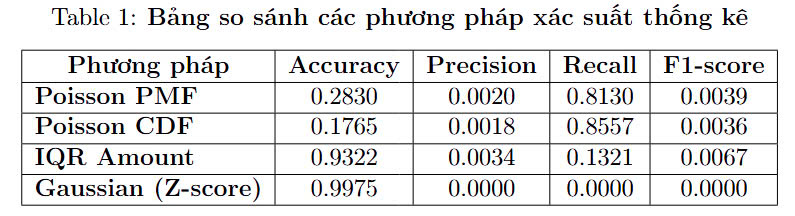

## Probability Statistic on Anomaly Detection - A Survey
This repository contains the implementation and experimental results of our research on anomaly detection by using Probability Statistic.

## Introduction
1. **Input**
   - Column 1: Time (second), each second has many withdrawals.
   - Column 2: Amount - money after each transaction.
   - Column 3: Class - normal data is labeled as 0, while abnormal data is labeled as 1
2. **Output**
   - The model outputs values comparing the accuracy of statistical probability methods with the original data.

## Main Contributions

1. **Data preprocessing**
   - Change the Time(second) to minute.
   - Calculate the mean of Time each minute.
   - Use the log function for Amount.
2. **Probability and Statistical Calculation**
   - Calculate on Poisson distribution, Gaussian distribution and Interquartile Range method.
3. **Default Thresholds Setup**
   - Set the threshold(s) for each Probability and Statistical method.
   - Optimizational threholds of Poisson distribution is tested by using [thresholdSelection.py](Implementation/thresholdSelection.py)
4. **Implementation**
   - Experimental code is stored in [main.py](Implementation/main.py).
   - Evaluational code is stored in [evaluation.py](Implementation/evaluation.py)
5. **Result**
   - The result includes:
      + [Final_Credit](Result/credit_final_anomalies.csv)
      + Comparison table among Probability and Statistical methods.
        

### Hardware
- Laptop MSI Katana 15 B13VEK (Intel i7-13620H)

### Software
- Visual Studio Code (VS code)
- Python 3.7+
- Required libraries:
  ```
  pandas
  numpy
  scipy
  sklearn
  ```

## Dataset Access

- Test datasets are available at: [Credit Card Fraud Detection](Dataset/creditcard.csv)
- Reference at https://www.kaggle.com/datasets/mlg-ulb/creditcardfraud/data

## Usage

1. Clone the repository:
```bash
git clone https://github.com/khuutrongquan/MAS_project_SE1821_G1.git
cd project_mas_se1921
```

2. Run experiments (edit the file_path and corresponding key):
```bash
python Implementation/main.py
python Implementation/evaluation.py
```

## Lecturer
- Mrs Lê Ánh Dương

## Authors
- Khưu Trọng Quân - SE192441
- Huỳnh Khả Tú - SE182134
- Lê Đức Trung Thi - DE180553
- Nguyễn Thành Luân - SE172429
- Nguyễn Phúc Đạt - SE182125
- Nguyễn Xuân Trường - SE182688
- Nguyễn Thị Lộc Nhi - SE182735
- Nguyễn Vĩnh Khang - SE182879

FPT University, Ho Chi Minh, Vietnam

## License
This project is licensed under the MIT License - see the LICENSE file for details.
